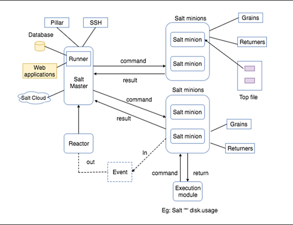

SALTSTATES
----------




# Configuration initiale du salt-minion


Configurer l'ID du minion (sous la forme connue par salt, par exemple sys.serveur1) dans /etc/salt/minion_id :

```bash
minion# echo "<minion_id>"> /etc/salt/minion_id
```

Configurer le salt-master dans /etc/salt/minion :

- pour se connecter au serveur salt de production :

```bash
minion# sed -i -e 's/#master: salt/master: salt.digitastuces.com/' /etc/salt/minion
```bash

- pour se connecter au serveur salt de dev :

```bash
minion# sed -i -e 's/#master: salt/master: salt.digitastuces.com/' /etc/salt/minion
```

Relancer le service salt-minion :

```bash
minion# systemctl restart salt-minion
```

Accepter la clef du le minion sur le master :

```bash
master$ sudo salt-key -a <minion>
```

## Configuration et mise à jour de salt-minion

Lancer enfin la commande suivante (en dev comme en production) qui configure, sur le minion, les dépôts APT et met à jour et configure salt-minion :

```bash
master$ salt <minion> state.sls services.salt-minion saltenv=production
```

NB : il est possible que cette commande ne donne pas de retour, si le client salt redémarre pendant la mise-à-jour.

Une fois le minion configuré la référence cli `saltenv=production` n'est plus nécessaire

## Vérification

Il est possible de vérifier que le paramètre saltenv a bien été pris en compte avec

```bash
master$ salt <minion> config.get saltenv
```

ainsi que la version installée avec

```bash
master$ salt <minion> test.version
```

Si l'un des deux ne correspond pas, il faut relancer le state.
